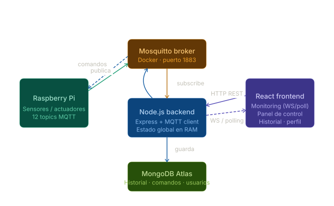
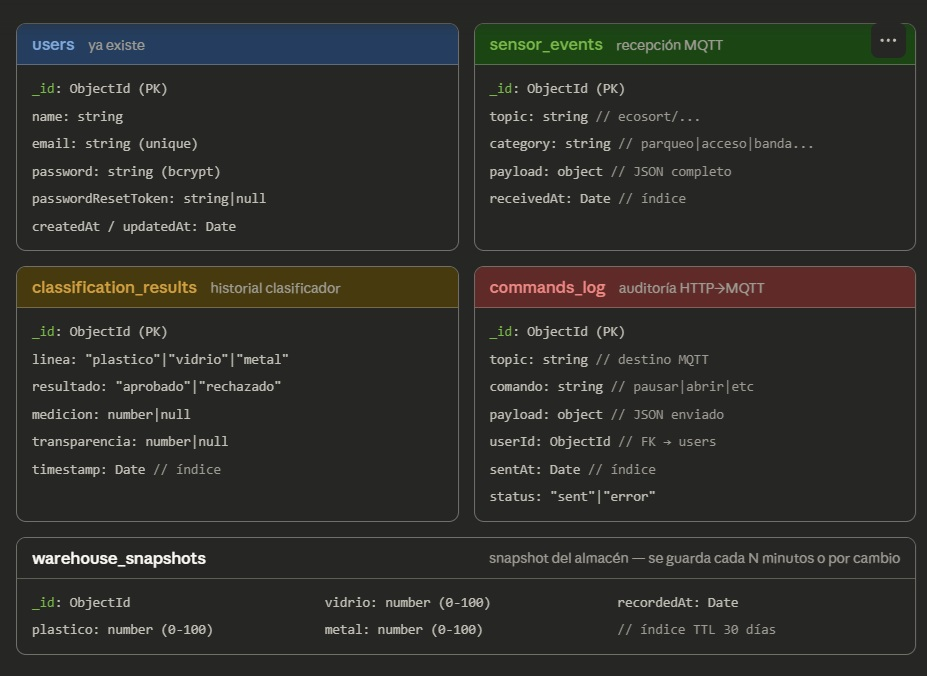
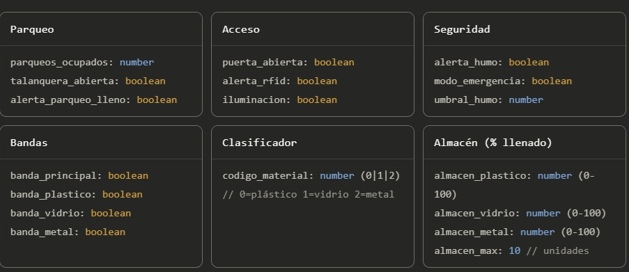

# Diagramas para el proyecto EcoSort

## Diagrama de arquitectura

  
  
<i>Figura 1: Diagrama de arquitectura de proyecto EcoSort.</i>

--- 

## Diagrama de base de datos

  
  
<i>Figura 2: Diagrama de base de datos de proyecto EcoSort.</i>

---

## Diagrama de flujo

  
  
<i>Figura 3: Diagrama de flujo de proyecto EcoSort.</i>

---

## Estado global

  
  
<i>Figura 4: Imagen que muestra el estado global del sistema.</i>

---