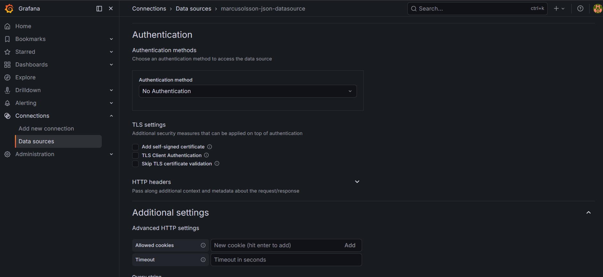

## Configuración de grafana

```yaml
version: "3.8"

services:
  # =============================
  # BACKEND
  # =============================
  backend:
    build:
      context: ./backend
      dockerfile: Dockerfile
    container_name: backend_app
    env_file:
      - ./backend/.env
    ports:
      - "4000:4000"
    depends_on:
      - mqtt
    restart: always
    networks:
      - app_network

  # =============================
  # FRONTEND
  # =============================
  frontend:
    build:
      context: ./frontend
    container_name: frontend
    env_file:
      - ./frontend/.env
    ports:
      - "5173:80"
    depends_on:
      - backend
    restart: always
    networks:
      - app_network

  # =============================
  # MQTT BROKER
  # =============================
  mqtt:
    image: eclipse-mosquitto
    container_name: mqtt_broker
    ports:
      - "1883:1883"
      - "9001:9001"
    volumes:
      - ./mosquitto/config:/mosquitto/config
      - ./mosquitto/data:/mosquitto/data
      - ./mosquitto/log:/mosquitto/log
    restart: always
    networks:
      - app_network

  # =============================
  # GRAFANA
  # =============================
  grafana:
    image: grafana/grafana:latest
    container_name: grafana
    ports:
      - "3000:3000"
    environment:
      - GF_SECURITY_ADMIN_USER=admin
      - GF_SECURITY_ADMIN_PASSWORD=admin
      - GF_SECURITY_ALLOW_EMBEDDING=true
      - GF_INSTALL_PLUGINS=marcusolsson-json-datasource
    volumes:
      - grafana_data:/var/lib/grafana
    depends_on:
      - backend
    restart: always
    networks:
      - app_network

volumes:
  grafana_data:

networks:
  app_network:
    driver: bridge
```

---

# 🚀 Cómo usarlo

## 1. Levantar todo

```bash
docker-compose up
```

---

## 2. Entrar a Grafana

* URL: [http://localhost:3000](http://localhost:3000)
* Usuario: `admin`
* Password: `admin`

---

## 3. Configurar JSON API

En Grafana:

1. **Connections → Data sources**
2. Agregar: **JSON API**
3. URL:

```text
http://backend_app:4000
```

👉 Nota importante:

* Se usa `backend_app` (nombre del servicio Docker)
* NO `localhost`

---

## 4. Ejemplo de endpoint hacia la api

```js
app.get('/metrics/users', async (req, res) => {
  res.json([
    {
      target: "users",
      datapoints: [
        [20, Date.now() - 10000],
        [25, Date.now()]
      ]
    }
  ]);
});
```

---

## Configuración de los frames

El iframe debe de apuntar a:

```text
http://localhost:3000/d-solo/UID/dashboard?panelId=1&refresh=5s
```

---

## Imagenes de configuración

<div align="center">
  
  <p><i>Figura 1: Configuración de grafana.</i></p>
</div>

---

<div align="center">
  
  <p><i>Figura 2: Configuración de grafana.</i></p>
</div>

---

<div align="center">
  
  <p><i>Figura 3: Configuración de grafana.</i></p>
</div>

---