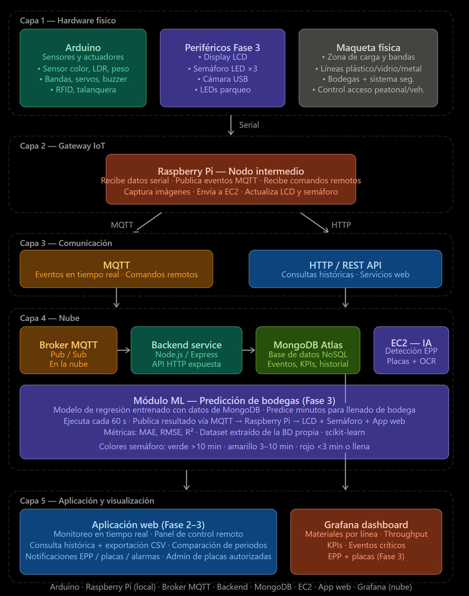
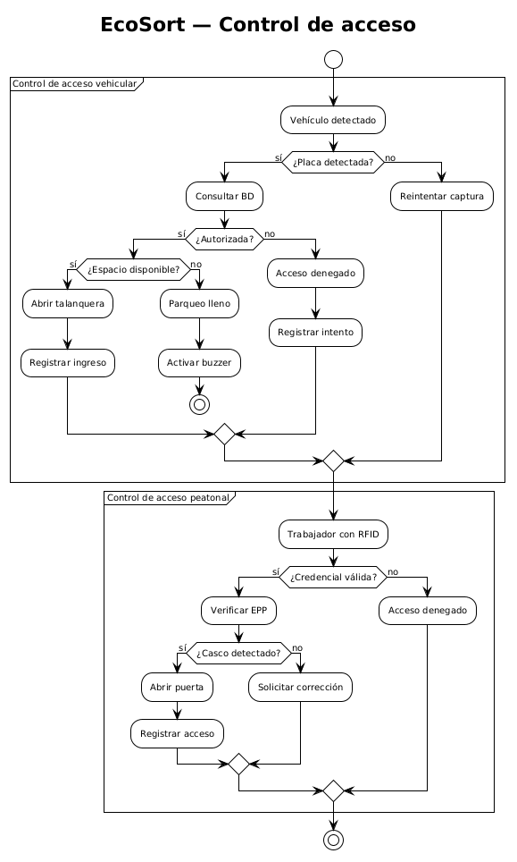
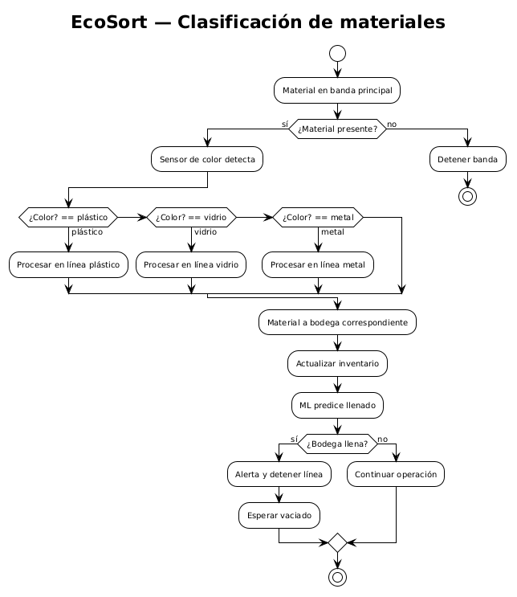
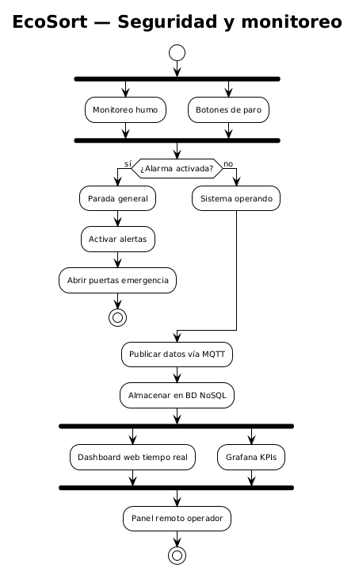

# EcoSort - Manual Técnico Fase 3

## Tabla de contenidos

1. Propósito del documento
2. Alcance técnico de la Fase 3
3. Arquitectura general del sistema
4. Componentes principales
5. Flujo de datos extremo a extremo
6. Backend: rutas, persistencia y tiempo real
7. Integración con MQTT
8. Modelo de predicción de bodegas
9. Visualización en la aplicación web
10. Grafana extendido
11. Despliegue y operación
12. Estado del repositorio y observaciones técnicas
13. Conclusión

---

## 1. Propósito del documento

Este manual describe la arquitectura extendida de EcoSort en su Fase 3, integrando visión computacional, machine learning y análisis avanzado de datos sobre la base funcional de la Fase 2. El objetivo es documentar cómo se conectan los sensores, la Raspberry Pi, el backend, los servicios de inteligencia artificial en EC2, la base de datos, MQTT, Socket.io, la aplicación web y Grafana.

El documento también resume el funcionamiento de cada nuevo subsistema y el flujo de datos extremo a extremo, desde la captura física hasta la visualización en tiempo real y las notificaciones.

## 2. Alcance técnico de la Fase 3

La Fase 3 agrega tres capacidades principales:

1. Verificación de EPP en el acceso peatonal mediante un servicio de visión computacional alojado en EC2.
2. Reconocimiento y validación de placas vehiculares con extracción OCR y administración de placas autorizadas.
3. Predicción de llenado de bodegas con un modelo de regresión entrenado sobre datos históricos del propio sistema.

Como extensiones funcionales, el sistema incorpora además notificaciones en tiempo real, exportación CSV, comparación de periodos en la consulta histórica, visualizaciones ampliadas en Grafana y salida física en LCD y semáforos LED.

## 3. Arquitectura general del sistema

EcoSort mantiene la arquitectura distribuida de la Fase 2 y agrega una nueva capa de inteligencia artificial. La solución se organiza en seis niveles:

| Capa | Función principal |
|---|---|
| Hardware y campo | Sensores, actuadores, cámara, LCD, LEDs, talanquera, puerta, buzzer y componentes de la maqueta |
| Raspberry Pi | Gateway IoT local, captura de imágenes, comunicación con el backend y control de periféricos |
| Backend Node.js | API principal, persistencia, autenticación, monitoreo, control y publicación de eventos |
| Microservicios de IA | Verificación de EPP, reconocimiento de placas y predicción de bodegas |
| Persistencia y mensajería | MongoDB y MQTT para histórico, eventos y distribución en tiempo real |
| Visualización | Aplicación web y Grafana |

La arquitectura respeta dos principios centrales:

- MQTT se utiliza para eventos y estado en tiempo real.
- HTTP se utiliza para consultas, control de servicios y comunicación con los modelos de IA.

  

## 4. Componentes principales

### 4.1 Raspberry Pi

La Raspberry Pi actúa como nodo intermedio entre el mundo físico y los servicios de software. Sus responsabilidades son:

- Leer eventos del entorno físico.
- Capturar imágenes cuando se activa un flujo de EPP o de placas.
- Enviar imágenes a los servicios de IA por HTTP.
- Recibir resultados de los servicios de IA y transmitirlos al backend.
- Actualizar LCD y semáforos LED en función de las predicciones de bodega.
- Publicar y consumir mensajes MQTT según el flujo operativo.

### 4.2 Backend central

El backend está implementado en Node.js con Express y concentra la lógica de negocio del sistema. En el arranque del servidor se inicializan:

- Conexión a MongoDB.
- Servidor HTTP principal.
- Socket.io para actualizaciones en tiempo real.
- Cliente MQTT para integración con la Raspberry Pi.
- Suscripciones a topics MQTT.

El archivo de entrada del backend une estas piezas y expone las rutas de autenticación, control, monitoreo, Grafana, EPP y placas.

### 4.3 Microservicio de EPP

El servicio de EPP está implementado en Python con FastAPI y utiliza un modelo YOLO de detección de equipo de protección personal. Su tarea es evaluar si la imagen enviada contiene el casco requerido para permitir el acceso.

Características del servicio:

- Descarga y carga del modelo desde Hugging Face.
- Procesamiento de la imagen recibida en formato base64 o archivo binario.
- Inferencia sobre la imagen y extracción de detecciones.
- Generación de una imagen anotada como evidencia.
- Respuesta con el resultado de acceso, elementos faltantes y detecciones.

### 4.4 Microservicio de reconocimiento de placas

El servicio de placas también está implementado en Python con FastAPI. Se encarga de detectar y normalizar el texto de la placa usando OCR sobre la imagen enviada por la Raspberry Pi.

Su flujo es:

- Recibir la imagen por HTTP.
- Ejecutar OCR con EasyOCR.
- Filtrar candidatos válidos.
- Normalizar el texto de la placa.
- Retornar la placa detectada, su confianza y un estado de éxito o fallo.

### 4.5 Módulo de predicción de bodegas

La predicción de llenado se plantea como un microservicio independiente desplegado en EC2. Su función es estimar el tiempo restante para que una bodega alcance su capacidad máxima a partir de datos históricos generados por la planta.

Aunque la carpeta base del servicio existe en el repositorio, el manual documenta la implementación esperada de acuerdo con el alcance de la Fase 3:

- Entrenamiento con datos históricos del propio sistema.
- Uso de un modelo de regresión sencillo y explicable.
- Recalculo periódico de predicciones.
- Publicación de resultados para la interfaz web y para los componentes físicos.

### 4.6 Aplicación web

La aplicación web extiende la interfaz de la Fase 2 con:

- Monitoreo en tiempo real de EPP y placas.
- Administración de placas autorizadas.
- Visualización de predicciones de bodega.
- Notificaciones en tiempo real.
- Exportación de datos históricos a CSV.
- Modo de comparación de periodos.

### 4.7 Grafana

Grafana se conserva como capa analítica de la solución. En esta fase se agregan visualizaciones específicas para los nuevos subsistemas de IA, especialmente:

- Evolución de verificaciones de EPP.
- Desempeño del reconocimiento de placas.

## 5. Flujo de datos extremo a extremo

### 5.1 Flujo de verificación de EPP

1. El usuario presenta su credencial RFID en el acceso peatonal.
2. El sistema valida primero si el usuario está autorizado.
3. Si la validación es correcta, la Raspberry Pi activa la cámara.
4. La imagen se envía por HTTP al microservicio de EPP en EC2.
5. El servicio ejecuta el modelo YOLO y determina si hay casco.
6. El backend registra el resultado en MongoDB.
7. El backend emite el evento por Socket.io para el frontend.
8. Si el acceso cumple, la puerta se habilita; si no cumple, se mantiene bloqueada, se activa buzzer y se reinicia el flujo.

### 5.2 Flujo de reconocimiento de placas

1. El vehículo se aproxima a la zona de acceso.
2. La Raspberry Pi activa la cámara y captura la placa.
3. La imagen se envía al microservicio de placas en EC2.
4. El servicio retorna una placa detectada o un error si no pudo leerla.
5. La Raspberry Pi normaliza el texto y lo envía al backend.
6. El backend compara la placa contra el registro de placas autorizadas.
7. Se almacena el intento en MongoDB.
8. Se emite un evento en tiempo real hacia el frontend.
9. Si la placa está autorizada, la talanquera abre; si no, permanece cerrada y se activa la alerta correspondiente.

### 5.3 Flujo de predicción de bodegas

1. El sistema extrae datos históricos de MongoDB.
2. Se construye un dataset con variables derivadas del nivel de llenado, ritmos de ingreso y comportamiento reciente.
3. Se entrena un modelo de regresión para la bodega seleccionada.
4. El modelo produce una estimación en minutos para saturación.
5. El resultado se publica por los mecanismos de comunicación del sistema.
6. La Raspberry Pi actualiza el LCD y los LEDs.
7. El backend y la interfaz web muestran el valor predicho y el estado actual.

### 5.4 Flujo de notificaciones y monitoreo

Los eventos críticos generan notificaciones visuales en la interfaz sin recarga manual. Entre los eventos que deben notificar se incluyen:

- Incumplimiento de EPP.
- Placa no autorizada.
- Bodega llena.
- Activación de sensores críticos.

Los eventos operativos normales siguen disponibles en el monitoreo, pero no generan notificación crítica.

  

  

  

## 6. Backend: rutas, persistencia y tiempo real

### 6.1 Rutas principales del backend

| Ruta | Método | Uso |
|---|---|---|
| /api/epp/verify | POST | Envío de imagen al servicio de EPP |
| /api/epp/verifications | GET | Consulta histórica de verificaciones |
| /api/epp/health | GET | Estado del microservicio de EPP |
| /api/plates/detect | POST | Detección de placa sobre imagen |
| /api/plates/authorized | GET | Listado de placas autorizadas |
| /api/plates/authorized | POST | Crear placa autorizada |
| /api/plates/authorized/:id | PUT | Actualizar placa autorizada |
| /api/plates/authorized/:id | DELETE | Eliminar placa autorizada |
| /api/plates/validate | POST | Validar placa detectada contra la base |
| /api/plates/detections | GET | Historial de detecciones |
| /api/monitoring/state | GET | Estado público actual de la planta |
| /api/monitoring/events | GET | Eventos de sensores |
| /api/monitoring/classifications | GET | Resultados de clasificación |
| /api/monitoring/classifications/stats | GET | Estadísticas de clasificación |
| /api/monitoring/commands | GET | Historial de comandos |
| /api/grafana/epp-verificaciones | GET y POST | Serie temporal de EPP |
| /api/grafana/reconocimiento-placas | GET y POST | Serie temporal de placas |

### 6.2 Persistencia de datos

Los principales documentos almacenados en MongoDB son:

- EPP verificaciones: resultados de acceso, detecciones y fecha de creación.
- Placas autorizadas: registro administrable de números de placa activos o inactivos.
- Detecciones de placas: texto detectado, estado de autorización, confianza y origen.
- Eventos de sensores: trazabilidad operativa de la planta.
- Resultados de clasificación: validaciones por línea de reciclaje.
- Logs de comandos: trazabilidad de acciones enviadas desde la interfaz.

### 6.3 Actualización en tiempo real

El backend emite eventos Socket.io para mantener sincronizada la interfaz web con el estado operativo de la planta. Los eventos más relevantes son:

- state_update: actualización del estado público de la planta.
- epp_update: nuevo resultado de verificación de EPP.
- plate_update: nuevo intento de detección o validación de placa.

## 7. Integración con MQTT

MQTT sigue siendo el canal principal para eventos operativos entre la Raspberry Pi y el backend. La suscripción central del backend incluye topics relacionados con:

- Parqueos.
- Talanquera.
- Puerta de acceso.
- Bandas de procesamiento.
- Clasificador.
- Seguridad por humo.

Este esquema permite separar la telemetría en tiempo real de las consultas históricas por HTTP.

## 8. Modelo de predicción de bodegas

### 8.1 Fuente de datos

El modelo debe entrenarse con datos históricos reales del sistema. Si el historial no es suficiente, se pueden complementar datos mediante simulación, siempre preservando coherencia con el comportamiento operativo de la planta.

### 8.2 Variables de entrada sugeridas

- Porcentaje actual de llenado.
- Ritmo de ingreso de materiales.
- Tendencia reciente de ocupación.
- Frecuencia de eventos por intervalo.
- Tiempo entre clasificaciones.

### 8.3 Salida del modelo

La salida principal es una estimación en minutos del tiempo restante para llenado total.

Estados especiales:

- LLENA: cuando la capacidad máxima ya fue alcanzada.
- SIN FLUJO: cuando no existe movimiento de materiales y no es posible estimar una tendencia útil.

### 8.4 Evaluación

Para documentar la calidad del modelo se deben reportar, como mínimo:

- MAE.
- RMSE.
- R2.

Estas métricas deben documentarse por cada bodega modelada.

### 8.5 Distribución del resultado

La predicción se publica hacia:

- La aplicación web, para monitoreo en tiempo real.
- El LCD, para mostrar nombre de bodega, porcentaje y tiempo estimado.
- El semáforo LED, con la siguiente lógica:
  - Verde: más de 10 minutos para saturación.
  - Amarillo: entre 3 y 10 minutos.
  - Rojo: menos de 3 minutos o bodega llena.

## 9. Visualización en la aplicación web

### 9.1 Módulo de monitoreo

El monitoreo en tiempo real debe mostrar el último estado de:

- EPP.
- Validación de placas.
- Predicciones de bodegas.
- Eventos críticos.

### 9.2 Administración de placas

El módulo de placas autorizadas permite:

- Crear placas.
- Editarlas.
- Eliminarlas.
- Activarlas o desactivarlas.

### 9.3 Exportación CSV

La exportación histórica debe generar un archivo CSV con columnas fijas:

- Marca de tiempo.
- Tipo de evento.
- Línea o componente asociado.
- Valor o resultado.
- Causa, si aplica.

El nombre del archivo debe incluir el rango de fechas exportado.

### 9.4 Comparación de periodos

El modo de comparación muestra dos rangos de fechas en paralelo. El filtro por tipo de evento aplica a ambos periodos y las visualizaciones deben diferenciar claramente cada serie.

## 10. Grafana extendido

Los paneles nuevos deben centrarse en el comportamiento de los modelos y no duplicar lo que ya muestra la interfaz operativa.

### 10.1 Evolución de verificaciones de EPP

La serie debe separar:

- Verificaciones exitosas.
- Verificaciones fallidas.
- Total de intentos.

### 10.2 Desempeño del reconocimiento de placas

La serie debe separar:

- Detección exitosa con placa autorizada.
- Detección exitosa con placa no autorizada.
- Intentos fallidos sin lectura válida.

## 11. Despliegue y operación

### 11.1 Infraestructura recomendada

- Docker y Docker Compose para el stack principal.
- MongoDB para persistencia.
- Mosquitto como broker MQTT.
- Instancias EC2 para los servicios de visión computacional.
- Contenedores o procesos separados para el servicio de predicción.

### 11.2 Variables y dependencias críticas

- URL del frontend para CORS y Socket.io.
- URL del broker MQTT.
- URL de los servicios de EPP y placas.
- Clave de API para Grafana.
- Credenciales de base de datos.

### 11.3 Consideraciones operativas

- La verificación de EPP y placas no debe bloquear el flujo físico por tiempos excesivos.
- Los modelos deben responder por HTTP y devolver errores claros si fallan.
- La Raspberry Pi debe poder operar de forma autónoma para LCD y LEDs una vez recibida la predicción.
- El backend debe conservar trazabilidad de cada intento y evento importante.

## 12. Estado del repositorio y observaciones técnicas

A partir de la revisión del código, la integración de EPP, placas, monitoreo, MQTT, Socket.io y Grafana sí está alineada con la arquitectura descrita en este manual.

También se identificó que la carpeta base del servicio de predicción existe, pero su punto de entrada aún está vacío. Para completar la Fase 3 de forma consistente con el enunciado, ese servicio debe implementarse y conectarse al flujo descrito en la sección de predicción de bodegas.

## 13. Conclusión

EcoSort Fase 3 transforma la planta recicladora automatizada en una plataforma IoT inteligente que combina automatización física, visión computacional, machine learning y visualización analítica. La arquitectura conserva la base funcional de la Fase 2 y la extiende con servicios de IA que toman decisiones sobre el acceso peatonal y vehicular, el estado de las bodegas y la notificación de eventos críticos.

Este manual documenta la estructura técnica necesaria para operar, ampliar y mantener el sistema con coherencia entre hardware, backend, servicios en la nube, base de datos y visualización.