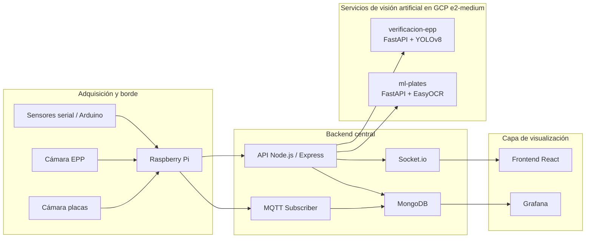
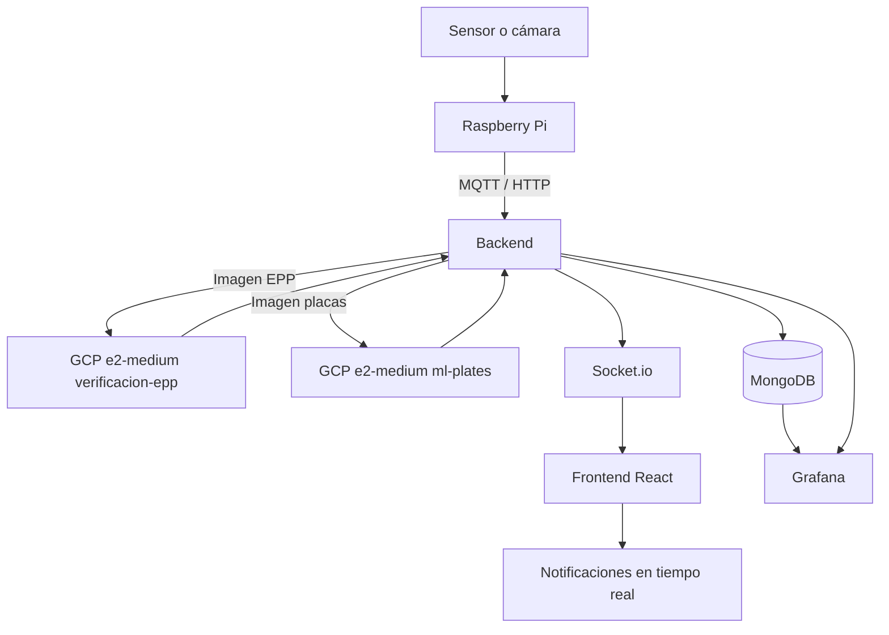
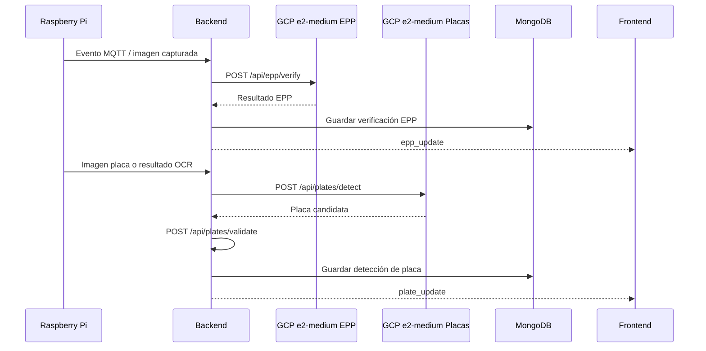

# Manual Técnico EcoSort

## 1. Introducción

Este documento describe la arquitectura extendida del sistema EcoSort y el funcionamiento de las funcionalidades incorporadas en la Fase 3. El sistema integra adquisición de datos desde sensores físicos, procesamiento en el backend, publicación de eventos en tiempo real, visualización operativa en el frontend y dos servicios de visión artificial desplegados en máquinas GCP `e2-medium` separadas: verificación de EPP y reconocimiento de placas.

El objetivo de esta versión es automatizar y auditar el flujo completo de la planta, incluyendo acceso peatonal, acceso vehicular, monitoreo de variables críticas, notificaciones en tiempo real y visualizaciones históricas en Grafana.

## 1.1 Diagramas generales

### Arquitectura extendida

### Flujo completo de datos

---

## 2. Arquitectura extendida del sistema

La solución se organiza en cinco capas principales:

1. **Capa de adquisición**: sensores conectados a la Raspberry Pi y al Arduino envían eventos por serial y MQTT.
2. **Capa de orquestación**: la Raspberry traduce comandos físicos en mensajes hacia el backend y los microservicios.
3. **Capa de backend**: Node.js + Express centraliza autenticación, persistencia, API HTTP, WebSockets y suscripción MQTT.
4. **Capa de inteligencia artificial**: dos servicios externos procesan imágenes, uno para EPP y otro para placas.
5. **Capa de visualización**: frontend React, WebSocket y Grafana muestran estado, histórico, KPIs y notificaciones.

### Componentes principales

- **Raspberry Pi**: puente entre sensores, actuadores, cámara y backend.
- **Backend**: API principal de EcoSort.
- **MongoDB**: persistencia de usuarios, eventos, estados, comandos, verificaciones y placas.
- **MQTT Broker**: transporte liviano de eventos de planta.
- **Frontend**: consola web para operación y monitoreo.
- **Grafana**: tableros para análisis de indicadores y series temporales.
- **GCP e2-medium verificación EPP**: servicio FastAPI con YOLOv8.
- **GCP e2-medium placas**: servicio FastAPI con EasyOCR.

---

## 3. Despliegue en máquinas GCP e2-medium

La arquitectura de Fase 3 separa las tareas de visión artificial en máquinas GCP `e2-medium` independientes para aislar consumo de CPU, memoria y dependencias de ML.

### 3.1 Máquina GCP e2-medium para verificación de EPP

- **Servicio**: `verificacion-epp`
- **Tecnología**: FastAPI + Ultralytics YOLOv8
- **Puerto expuesto**: `8080`
- **Endpoint principal**: `POST /api/ppe/analyze`
- **Función**: recibe una imagen, detecta casco y otros elementos de protección, calcula si el acceso está permitido y devuelve imagen anotada.

### 3.2 Máquina GCP e2-medium para reconocimiento de placas

- **Servicio**: `ml-plates`
- **Tecnología**: FastAPI + EasyOCR + OpenCV
- **Puerto expuesto**: `8000`
- **Endpoint principal**: `POST /detect-plate`
- **Función**: recibe una imagen, extrae candidatos de placa, normaliza el texto y devuelve la mejor coincidencia.

### 3.3 Backend central

- **Servicio**: Node.js + Express + TypeScript
- **Puerto**: `4000`
- **Función**: orquesta autenticación, persistencia, exposición de endpoints HTTP, eventos en tiempo real y conectividad con MQTT.

### 3.4 Broker MQTT

- **Host**: mismo nodo de red del backend desplegado
- **Puerto**: `1883`
- **Función**: transporte de eventos operativos entre Raspberry y backend.

---

## 4. Diseño de los modelos de predicción

### 4.1 Modelo de EPP

El modelo de EPP se basa en una arquitectura YOLOv8 orientada a detección de objetos. Su objetivo es identificar elementos de protección personal y decidir si el acceso peatonal puede habilitarse.

#### Diseño funcional

- Entrada: imagen RGB capturada desde cámara.
- Procesamiento: inferencia con YOLOv8 a una resolución fija y umbral de confianza configurable.
- Salida: conjunto de detecciones por clase, lista de elementos obligatorios faltantes, y una imagen anotada.
- Regla de negocio: si el casco está presente, el acceso se considera permitido; si no, se bloquea.

#### Artefacto utilizado

El servicio descarga el peso entrenado desde Hugging Face al arrancar. En el código operativo se usan candidatos como `best.pt`, `model.onnx` o `best.onnx`, y se carga con Ultralytics.

#### Consideraciones de entrenamiento

El entrenamiento del modelo se realiza fuera del runtime del servidor, usando imágenes etiquetadas de EPP. La versión desplegada consume el modelo ya entrenado; por lo tanto, el backend no reentrena, solo ejecuta inferencia.

### 4.2 Modelo de reconocimiento de placas

El reconocimiento de placas se resuelve con OCR en vez de un detector entrenado desde cero.

#### Diseño funcional

- Entrada: imagen de la placa o frame de la cámara.
- Procesamiento: lectura OCR con EasyOCR.
- Postprocesado: normalización a mayúsculas, eliminación de caracteres no alfanuméricos y filtrado por longitud/formato.
- Salida: mejor candidato de placa, nivel de confianza y lista de candidatos.

#### Consideraciones de entrenamiento

Este servicio se apoya en modelos preentrenados de OCR. No requiere una etapa de entrenamiento local; su valor agregado está en la normalización, filtrado inteligente y la integración con la validación en backend.

---

## 5. Funcionamiento de las nuevas funcionalidades

### 5.1 Verificación de acceso peatonal con EPP

1. La Raspberry detecta apertura de puerta.
2. Captura una imagen de la persona en el acceso.
3. La envía al backend en `POST /api/epp/verify`.
4. El backend reenvía la imagen a la máquina GCP de EPP.
5. El servicio de EPP retorna detecciones y estado de acceso.
6. El backend guarda el resultado en MongoDB.
7. El backend emite `epp_update` por Socket.io.
8. El frontend muestra la última verificación y dispara notificación si falta casco.

### 5.2 Reconocimiento y validación de placas

1. La Raspberry detecta vehículo o se ejecuta el cliente de pruebas sobre imágenes de `test_images`.
2. La imagen se envía al backend en `POST /api/plates/detect`.
3. El backend reenvía la imagen al servicio de placas en GCP.
4. El servicio OCR devuelve la placa más probable y su confianza.
5. El cliente de pruebas o la Raspberry envían el resultado a `POST /api/plates/validate`.
6. El backend valida la placa contra MongoDB.
7. El resultado se registra en la colección `plate_detections`.
8. El backend emite `plate_update` por Socket.io.
9. El frontend muestra la última detección y notifica si la placa no está autorizada.

### 5.3 Flujo de sensores de planta

Los eventos de planta se publican por MQTT desde la Raspberry y se consumen en el backend para actualizar el estado global.

Topics principales:

- `ecosort/planta/parqueos/estado`
- `ecosort/parqueo/talanquera/estado`
- `ecosort/parqueo/talanquera/alerta`
- `ecosort/acceso/puerta/estado`
- `ecosort/acceso/puerta/alarma`
- `ecosort/procesamiento/bandas/*`
- `ecosort/clasificador/material/detectado`
- `ecosort/clasificador/material/resultado`
- `ecosort/seguridad/alarma/humo`

Cada evento se persiste como histórico o actualiza el estado global en memoria, y posteriormente se replica a frontend y Grafana.

## 5.4 Resumen visual del ciclo operativo

---

## 6. Flujo de datos completo

### 6.1 Desde sensores hasta backend

1. Un sensor físico genera un cambio de estado.
2. La Raspberry publica el evento por MQTT o lo transmite por serial.
3. El backend suscrito al broker MQTT recibe el mensaje.
4. El handler correspondiente interpreta el payload.
5. El estado global de planta se actualiza.
6. Se registra el evento en MongoDB cuando aplica.

### 6.2 Desde cámaras hasta persistencia

#### EPP

1. Cámara del acceso peatonal.
2. Raspberry captura imagen.
3. Backend reenvía a GCP EPP.
4. Backend guarda verificación en MongoDB.
5. Socket.io emite actualización a frontend.

#### Placas

1. Cámara del acceso vehicular.
2. Raspberry o cliente de pruebas captura imagen.
3. Backend reenvía a GCP placas.
4. OCR devuelve placa candidata.
5. Backend valida y guarda en MongoDB.
6. Socket.io emite actualización a frontend.

### 6.3 Desde backend hacia visualización

1. El backend publica eventos en Socket.io.
2. El frontend recibe `state_update`, `epp_update` y `plate_update`.
3. Los componentes de interfaz actualizan estado, tablas y notificaciones.
4. Grafana consulta endpoints del backend para construir paneles y KPIs.

---

## 7. Backend: API, persistencia y eventos

### 7.1 Endpoints principales

- `POST /api/epp/verify`: verifica EPP desde imagen.
- `GET /api/epp/verifications`: historial de verificaciones.
- `POST /api/plates/detect`: detecta placa desde imagen.
- `POST /api/plates/validate`: valida placa contra lista autorizada.
- `GET /api/plates/detections`: historial de detecciones.
- `GET /api/plates/authorized`: lista de placas autorizadas.

### 7.2 Persistencia en MongoDB

Colecciones relevantes:

- `users`
- `authorized_plates`
- `plate_detections`
- `epp_verifications`
- `sensor_events`
- `classification_results`
- `command_logs`

### 7.3 WebSockets

El backend mantiene un servidor Socket.io para notificaciones en tiempo real. Los eventos más importantes son:

- `state_update`
- `epp_update`
- `plate_update`

El frontend usa estos eventos para refrescar el tablero sin recargar la página.

---

## 8. Visualizaciones y notificaciones nuevas

### 8.1 Visualización en frontend

El frontend consume el estado en tiempo real y renderiza:

- estado general de la planta,
- historial de eventos,
- últimas verificaciones de EPP,
- últimas detecciones de placas,
- notificaciones activas,
- dashboards embebidos de Grafana.

El componente de Grafana embebe dashboards mediante `iframe`, y la interfaz se conecta al backend con Socket.io para recibir cambios inmediatos.

### 8.2 Notificaciones en tiempo real

El hook de socket del frontend genera notificaciones cuando ocurren eventos críticos:

- incumplimiento de EPP,
- placa no autorizada,
- sensor crítico de humo,
- paro de emergencia,
- bodega llena.

Las notificaciones tienen prioridad y se limitan para evitar duplicados por reconexiones o reintentos rápidos.

### 8.3 Visualizaciones históricas en Grafana

El backend expone endpoints para consumo server-side desde Grafana, protegidos con `GRAFANA_API_KEY`.

Principales rutas:

- `GET/POST /api/grafana/materiales-por-linea`
- `GET/POST /api/grafana/parqueos-ocupacion`
- `GET/POST /api/grafana/eventos-criticos`
- `GET/POST /api/grafana/throughput`
- `GET/POST /api/grafana/kpis-produccion`
- `GET/POST /api/grafana/kpis-eventos-criticos`
- `GET/POST /api/grafana/actividad-sistema`
- `GET/POST /api/grafana/clasificador-color`

Estas consultas permiten construir series temporales, tablas de KPI y paneles de actividad para supervisión operativa.

---

## 9. Módulo de pruebas de los modelos

### 9.1 Cliente de EPP

El cliente de prueba de EPP permite:

- enviar imágenes manualmente,
- capturar desde cámara,
- probar contra backend o contra el servicio directo,
- repetir ejecuciones en bucle para pruebas de campo.

### 9.2 Cliente de placas

El cliente de placas procesa por defecto todas las imágenes de `test_images`.

Flujo del test:

1. Lee la carpeta `test_images`.
2. Envía cada imagen a `POST /api/plates/detect`.
3. Toma `plate` y `confidence` devueltos por el backend.
4. Reenvía esos datos a `POST /api/plates/validate`.
5. Imprime ambos resultados.

De este modo se verifica tanto la detección como la persistencia en base de datos sin modificar el endpoint de validación.

---

## 10. Variables de entorno relevantes

### Backend

- `PORT`
- `FRONTEND_URL`
- `MONGO_URI`
- `DB_NAME`
- `MQTT_BROKER_URL`
- `EPP_SERVICE_URL`
- `PLATES_SERVICE_URL`
- `GRAFANA_API_KEY`

### GCP e2-medium EPP

- `HOST`
- `PORT`

### GCP e2-medium placas

- `HOST`
- `PORT`
- `BACKEND_HOST`
- `BACKEND_PORT`

### Raspberry

- `BACKEND_API_URL`
- `MQTT_HOST`
- `MQTT_PORT`

---

## 11. Consideraciones operativas

- El backend debe desplegarse con acceso a MongoDB y al broker MQTT.
- Las máquinas GCP de visión artificial deben mantenerse accesibles desde la red del backend.
- El frontend requiere autenticación para conectarse al socket del backend.
- Grafana necesita la API key configurada para consultar el backend.
- Los modelos de EPP y placas deben validarse con imágenes reales representativas antes de pasar a producción.

---

## 12. Conclusión

La arquitectura extendida de EcoSort integra sensores, visión artificial, persistencia, visualización y alertas en tiempo real dentro de un flujo coherente de extremo a extremo. La separación en máquinas GCP `e2-medium` permite desacoplar el procesamiento de IA del backend principal, mientras que MongoDB, MQTT, Socket.io y Grafana completan la trazabilidad operativa y el monitoreo del sistema.

Con esta versión, EcoSort ya no solo recolecta y clasifica eventos de planta, sino que también automatiza accesos, registra evidencias de seguridad, habilita monitoreo histórico y genera notificaciones accionables para el operador.
